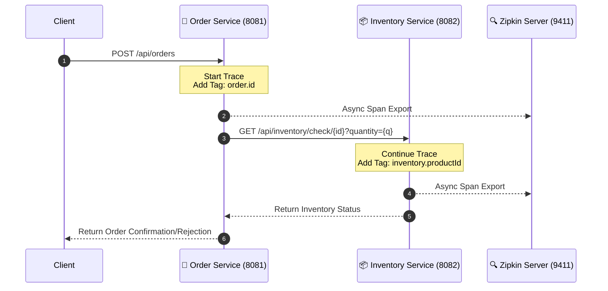

# 🌐 Distributed Tracing with Spring Boot & Zipkin

<p align="center">
  
  
  
  
  
</p>

An elegant microservices demonstration showcasing **Distributed Tracing** using Spring Boot 3, Micrometer Tracing (Brave bridge), and Zipkin. This project illustrates how requests flow across service boundaries, how to attach business-relevant custom span tags, and how to visualize system latency in real-time.

---

## 🛠️ Tech Stack

- **Framework**: Java 17+, Spring Boot 3.x
- **Observability**: Micrometer Tracing, Brave Bridge
- **Tracing Server**: OpenZipkin
- **Containerization**: Docker, Docker Compose
- **Build Tool**: Maven

---

## 🏗️ Architecture & API Workflow

The system is composed of two primary microservices and a Zipkin observability server.

### API Workflow
1. A client submits an order to the **Order Service**.
2. The **Order Service** initiates a trace and calls the **Inventory Service** via `RestTemplate` to verify stock availability.
3. The **Inventory Service** checks its local, in-memory state and responds.
4. Both services asynchronously send trace telemetry to **Zipkin**, including custom tags like `order.id` and `inventory.productId`.

### 📊 Workflow Diagram



---

## 🔌 API Endpoints

### 1. Create an Order
- **URL**: `POST http://localhost:8081/api/orders`
- **Body**:
  ```json
  {
    "orderId": "ord-001",
    "productId": "prod-123",
    "quantity": 5
  }
  ```
- **Response**:
  ```json
  {
    "orderId": "ord-001",
    "status": "CONFIRMED",
    "inventoryAvailable": true
  }
  ```

### 2. Check Inventory (Direct Access)
- **URL**: `GET http://localhost:8082/api/inventory/check/prod-123?quantity=5`

*(Note: `prod-123` is seeded with a quantity of 10 in the Inventory Service.)*

---

## 🔍 Zipkin Tracing Workflow

Zipkin provides a powerful UI to monitor your microservices request flows:

1. **Access the UI**: Navigate to [http://localhost:9411](http://localhost:9411).
2. **Search Traces**: Click the **"Run Query"** button (or search by specific tags/services) to see recent requests.
3. **Analyze Latency**: Click on any trace to view the timeline of spans across the Order and Inventory services. You can easily spot which service takes the longest to process.
4. **Inspect Custom Tags**: 
   - Click the `order-service` span to find the custom `order.id` tag.
   - Click the `inventory-service` span to find the custom `inventory.productId` tag.

This level of detail makes it incredibly easy to pinpoint bottlenecks and debug distributed requests in complex architectures.

---

## 🚀 How to Start the Project (Docker)

The entire infrastructure can be brought up with a single command using Docker Compose. Services are configured with health checks to ensure they start in the correct dependency order.

### Prerequisites
- [Docker](https://docs.docker.com/get-docker/) & Docker Compose installed and running.

### Quick Start

1. **Clone or Navigate** to the project directory.
2. **Build and start the containers** in detached mode:
   ```bash
   docker-compose up --build -d
   ```
3. **Verify running containers**:
   ```bash
   docker-compose ps
   ```
   *Wait a few moments for all containers (`zipkin`, `inventory-service`, `order-service`) to transition to a `(healthy)` status.*

4. **Test the Application**: You can now hit the API Endpoints and observe the traces in Zipkin!

### Stopping the Services
To gracefully stop and remove the containers, networks, and volumes:
```bash
docker-compose down
```

---

<p align="center">
  <i>Built with ❤️ for modern microservice observability.</i>
</p>
